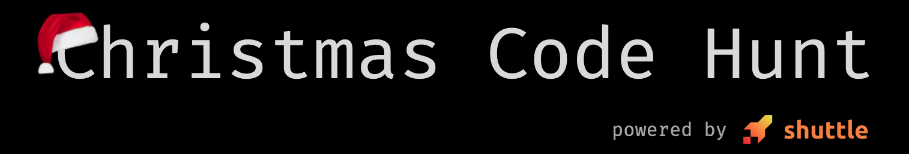

# Shuttle Christmas Code Hunt 2023

My solutions to the [Shuttle Christmas Code Hunt 2023](https://www.shuttle.rs/cch) puzzles. All of my solutions are developed using the [Rust 1.7.50 nightly](https://releases.rs/docs/1.75.0/) version, with the [axum](https://crates.io/crates/axum) web framework.

## Structure
Each day's solutions can be found in it's respective rust file. For example, day 1 can be found in the [`day1`](/src/days/day1/) file. Each day file contains my solution in an [axum](https://crates.io/crates/axum) handler.